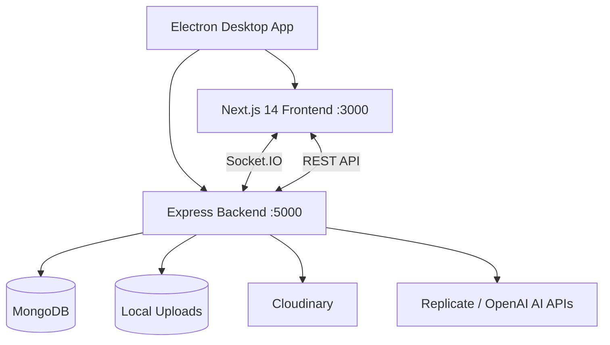

# Chatvora — Full Project Memory

## Overview
Full-stack real-time messaging platform with AI image generation, WebRTC voice/video calls, stories, groups, E2EE, PWA support, and an Electron desktop wrapper.

---

## Architecture



## Directory Structure

```
Chatvora/
├── frontend/          # Next.js 14 PWA client
│   └── src/
│       ├── app/       # Next.js App Router pages
│       ├── components/# React components
│       ├── hooks/     # Custom hooks
│       ├── lib/       # Utilities (API, socket, WebRTC, E2EE, etc.)
│       └── stores/    # Zustand stores
├── backend/           # Express + Socket.IO server
│   ├── config/        # Cloudinary config
│   ├── controllers/   # Route controllers (groupController.js)
│   ├── database/      # MongoDB connection
│   ├── middleware/     # Auth, rate limiter
│   ├── models/        # MongoDB native driver models
│   ├── modelsMongoose/# Mongoose models (unused/legacy)
│   ├── routes/        # Express route handlers
│   ├── services/      # WebSocket, disappearing messages, push notifications
│   ├── sockets/       # Re-exports services/websocket
│   ├── uploads/       # Local file storage
│   └── utils/         # Logger, network helpers
├── electron/          # Electron main process
├── lan-portal/        # Docker Compose for LAN deployment
├── docker/            # (empty)
├── docs/              # (empty)
├── release/           # Electron builder output
├── index.js           # Legacy PostgreSQL server (unused)
├── db.js              # Legacy PostgreSQL pool (unused)
└── Start Server.bat   # Windows startup script
```

---

## Frontend (Next.js 14 — `frontend/`)

### Tech Stack
- **Next.js 14** with App Router, standalone output
- **React 18** with hooks
- **Socket.IO Client** for real-time communication
- **Zustand** for state management
- **Framer Motion** for animations
- **Axios** for HTTP
- **next-pwa** for PWA support
- **react-icons** (Feather Icons)
- **emoji-picker-react** for emoji picking
- **react-dropzone** for file uploads
- **date-fns** for date formatting
- **sharp** for image processing

### Pages (`src/app/`)
| Route | File | Description |
|-------|------|-------------|
| `/` | `page.js` | Landing page (unauthenticated) or `ChatApp` (authenticated) |
| `/login` | `login/` | Login/register page |
| `/settings` | `settings/` | User settings |
| `/ai` | `ai/` | AI Image Studio page |
| `/admin` | `admin/` | Admin panel |
| `/offline` | `offline/` | Offline fallback |

### Components (`src/components/`)
| Component | Description |
|-----------|-------------|
| `ChatApp.js` | Main app shell — sidebar, chat area, modals, connection bar, mobile bottom nav, action buttons |
| `Sidebar.js` | Conversation list, search, user profile, story rings |
| `ChatArea.js` | Message list, input bar, typing indicators, replies, reactions, pinned messages, disappearing timer UI |
| `CallOverlay.js` | WebRTC call UI (pip, controls, screen share, group call grid) |
| `CreateGroupModal.js` | Group creation with member selection |
| `FileUploader.js` | Drag-and-drop file upload with preview |
| `GlobalSearch.js` | Global search across messages and conversations |
| `StoryViewer.js` | Instagram-style story viewer with progress bars |
| `WallpaperPicker.js` | Chat/app wallpaper customization |
| `VoiceRecorder.js` | Voice message recording |
| `ProfileManager.js` | Edit display name, bio, avatar |
| `OnboardingWizard.js` | First-time user onboarding flow |
| `LoadingScreen.js` | App loading skeleton |
| `DownloadForDesktop.js` | PWA/desktop install prompt |
| `InstallButton.js` | PWA install button |
| `AppProviders.js` | Wraps app with providers (Toast, etc.) |
| `ui/` | Button, Modal, Toast, Toggle, Skeleton, EmptyState, ErrorBoundary |

### Stores (`src/stores/`)
| Store | Description |
|-------|-------------|
| `authStore.js` | Auth state, login, logout, token management, socket init |
| `chatStore.js` | Conversations, messages, typing, optimistic sends, groups |
| `callStore.js` | WebRTC call state, signaling, room management |
| `settingsStore.js` | App settings (theme, notifications, etc.) |
| `wallpaperStore.js` | Wallpaper picker state |
| `onboardingStore.js` | Onboarding completion state |
| `aiStore.js` | AI image generation history |

### Lib/Tools (`src/lib/`)
| File | Description |
|------|-------------|
| `api.js` | Axios instance with JWT interceptors, all API endpoints |
| `socket.js` | Socket.IO client wrapper with listener tracking, reconnection, event wrappers |
| `socketNotifications.js` | Socket-based notification handling |
| `webrtc.js` | WebRTC helpers: peer connection factory, ICE servers, quality monitor, data channel |
| `encryption.js` | AES-GCM 256-bit E2EE via Web Crypto API |
| `aiBot.js` | Hardcoded "Nexus AI" bot/conversation objects |
| `notifications.js` | Push notification permission/registration |
| `ringtone.js` | Call ringtone audio utilities |
| `useKeyboardShortcuts.js` | Keyboard shortcut hook |

---

## Backend (Express — `backend/`)

### Tech Stack
- **Express 4** with `helmet`, `cors`, `express-rate-limit`, `express-validator`
- **MongoDB** via native driver (`mongodb` v6)
- **Socket.IO** for real-time messaging and WebRTC signaling
- **JWT** for authentication (`jsonwebtoken`)
- **bcryptjs** for password hashing
- **Multer** for file uploads (local + optional Cloudinary)
- **Winston** for logging
- **ioredis** (installed, usage TBD)
- **web-push** for push notifications
- **qrcode** for QR code generation
- **uuid** for unique IDs

### Database (`database/database.js`)
- Native MongoDB driver (NOT Mongoose for main models)
- Connection pool with events logging
- `connectDatabase()`, `getDb()`, `getClient()`, `closeDatabase()`
- `toObjectId()` helper
- Falls back to `mongodb-memory-server` in dev if connection fails

### Models (`models/`) — All use native MongoDB driver
| Model | Collection | Key Fields |
|-------|------------|------------|
| `User.js` | `users` | email, password (bcrypt), username, displayName, avatar, bio, phone, isOnline, lastSeen, contacts[], blockedUsers[], preferences, role, refreshToken |
| `Message.js` | `messages` | conversationId, sender, type (text/image/video/audio/file), content, media {url, type, name, size}, replyTo, status, isEdited, isDeleted, isPinned, reactions[], disappearAt, clientMessageId |
| `Conversation.js` | `conversations` | type (direct/group/ai), participants[], name, avatar, lastMessage, lastMessageAt, createdBy, isArchived, isPinned, isMuted, wallpaper, disappearTimer |
| `Group.js` | `groups` | name, description, avatar, cover, conversation, creator, members[], messages[], channels[], roles, permissions, inviteLinks[], isPublic |
| `GroupMember.js` | `group_members` | groupId, userId, role (admin/moderator/member), joinedAt, nickname |
| `GroupInvite.js` | `group_invites` | groupId, code, createdBy, expiresAt, maxUses, uses |
| `Channel.js` | `channels` | groupId, name, type, topic, isNSFW |
| `Call.js` | `calls` | callId, type (audio/video), conversationId, caller, receivers[], participants[], isGroup, status (initiated/accepted/rejected/ended), startedAt, endedAt, duration |
| `Notification.js` | `notifications` | userId, type, title, body, data, read, createdAt |
| `Story.js` | `stories` | userId, type (image/video/text), media, content, viewers[], reactions[], expiresAt (24h), createdAt |

### ModelsMongoose (`modelsMongoose/`) — Legacy/unused Mongoose schemas
- `User.js`, `ChatRoom.js`, `Message.js`

### Routes (`routes/ — all mounted under /api`)
| Route | File | Description |
|-------|------|-------------|
| `/api/auth` | `auth.js` | register, login, refresh, logout, me, update profile |
| `/api/users` | `user.js` | search, get user, block, contacts, QR code, online status |
| `/api/conversations` | `conversation.js` | CRUD, archive, pin, mute, leave, add participants, wallpaper, disappear timer |
| `/api/messages` | `message.js` | CRUD, search, forward, upload, react, pin, star |
| `/api/groups` | `group.js` | CRUD, members, roles, kick, invite, channels |
| `/api/upload` | `upload.js` | Single/multiple file upload, avatar upload |
| `/api/calls` | `call.js` | Call history, CRUD |
| `/api/stories` | `story.js` | CRUD, feed, view, react |
| `/api/notifications` | `notification.js` | Get, mark read, unread count, delete |
| `/api/admin` | `admin.js` | Stats, users CRUD, role management |
| `/api/ai` | `ai.js` | Generate image (Replicate/OpenAI/fallback), history, save, translate |

### WebSocket (`services/websocket.js`)
- JWT auth middleware on connection
- Tracks connected users (userId → Set of socketIds) for multi-tab support
- **Events handled:**
  - `conversation:join` — Join room, load history
  - `conversation:leave` — Leave room
  - `message:send` — Save to DB, broadcast to room, deduplicate by clientMessageId, update sidebar
  - `message:typing` — Typing indicators
  - `message:read` — Read receipts
  - `call:initiate`, `call:accept`, `call:reject`, `call:end` — Call signaling
  - `call:signal` — WebRTC offer/answer/ICE candidates
  - `call:ice_restart` — ICE restart forwarding
  - `call:quality_report` — Connection quality metrics
  - `call:create_room`, `room:join`, `room:leave`, `room:signal` — Group call rooms
  - `call:start` — Group call broadcast
- **Disconnect:** Updates DB to offline, cleans up call rooms, broadcasts offline status

### Other Services
- `services/disappearingMessages.js` — Scheduled cleanup of messages with `disappearAt` timestamp
- `services/pushNotifications.js` — Push notification sending
- `services/websocketNew.js` — Alternative WebSocket implementation with Mongoose (unused)

### Middleware
- `middleware/auth.js` — JWT verification, admin-only check
- `middleware/rateLimiter.js` — `authLimiter` and `generalLimiter` using `express-rate-limit`

### Configuration
- Runs on port 5000, binds to 0.0.0.0
- CORS allows localhost, LAN private IPs, and configured CLIENT_URL origins
- Upload directories: images/, videos/, audio/, documents/
- Automatic fallback to `mongodb-memory-server` in dev

---

## Electron (`electron/`)

### Main Process (`main.js`)
- Spawns backend (port 5000) and Next.js (port 3000) as child processes
- Shows loading spinner HTML while waiting for servers
- Retries on crash, kills processes on quit
- Port cleanup via `netstat`/`lsof` before starting
- Window: 1200x800, dark background, min 800x600
- Production: runs standalone Next.js server from `.next/standalone`

### Preload (`preload.js`)
- Context bridge for secure IPC

### Building
- `electron-builder` configured for Windows (NSIS), macOS (DMG), Linux (AppImage/deb)
- Extra resources: `.next/standalone`, `frontend/public`, `backend/`

---

## Deployment

### Scripts
- `npm run start` — Electron only (production)
- `npm run electron-dev` — Concurrently runs backend + frontend + Electron
- `npm run electron-build` — Builds Windows installer
- `Start Server.bat` — Windows dev startup script

### LAN Portal (`lan-portal/`)
- Docker Compose with Node.js production container on port 3000

### PWA
- Service worker from `public/sw-source.js`
- `next-pwa` for caching
- Manifest, icons, apple touch icon configured
- Offline page at `/offline`

---

## AI Features
- **Nexus AI Chat:** Fake bot conversation (`_id: 'ai-nexus'`) with trigger keywords
- **AI Image Generation** (`/api/ai/generate-image`):
  - Supports Replicate (Flux Schnell) and OpenAI DALL-E 3
  - Multiple styles: realistic, fantasy, cyberpunk, anime, 3d, oil_painting, watercolor, pixel_art
  - Fallback to picsum.photos placeholders if no API keys
  - History save/delete
- **Translation** (`/api/ai/translate`): LibreTranslate → Google Translate fallback

---

## Calling (WebRTC)
- STUN: Google public STUN servers
- Optional TURN via `NEXT_PUBLIC_TURN_*` env vars
- 1:1 calls via personal user rooms
- Group calls via dynamic `call_room:*` rooms
- Quality monitoring (RTT-based)
- ICE restart support
- Screen sharing
- Picture-in-picture mode

---

## Key Patterns
- **Multi-tab support:** Connected users tracked as `Map<userId, Set<socketId>>`
- **Optimistic updates:** Messages sent immediately with `clientMessageId`, deduplicated on server
- **Automatic token refresh:** Axios interceptor refreshes JWT on 401
- **Duplicate prevention:** `clientMessageId` checked server-side before saving
- **Message disappearing:** Timer set on conversation, cleanup via scheduled service

---

## Notes
- `index.js` and `db.js` at root are **legacy PostgreSQL** code — unused by the current app
- `modelsMongoose/` contains Mongoose schemas — the main app uses native MongoDB driver
- `services/websocketNew.js` is an alternative WS implementation — **not wired up**
- AI bot is hardcoded frontend-only — no real backend AI chat endpoint
- Cloudinary is optional; falls back to `./uploads/` directory
